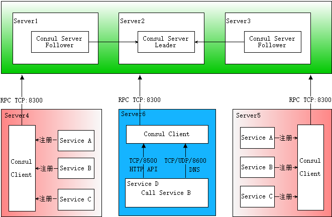
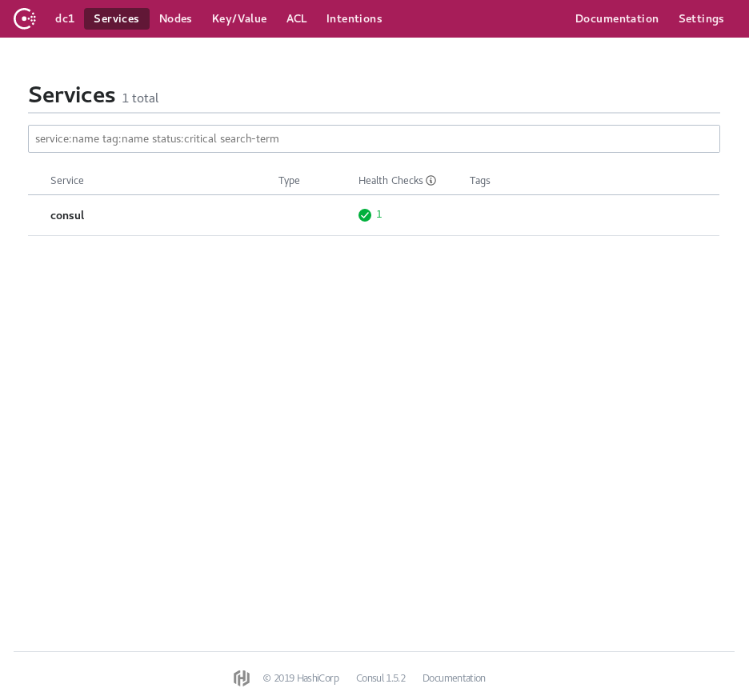
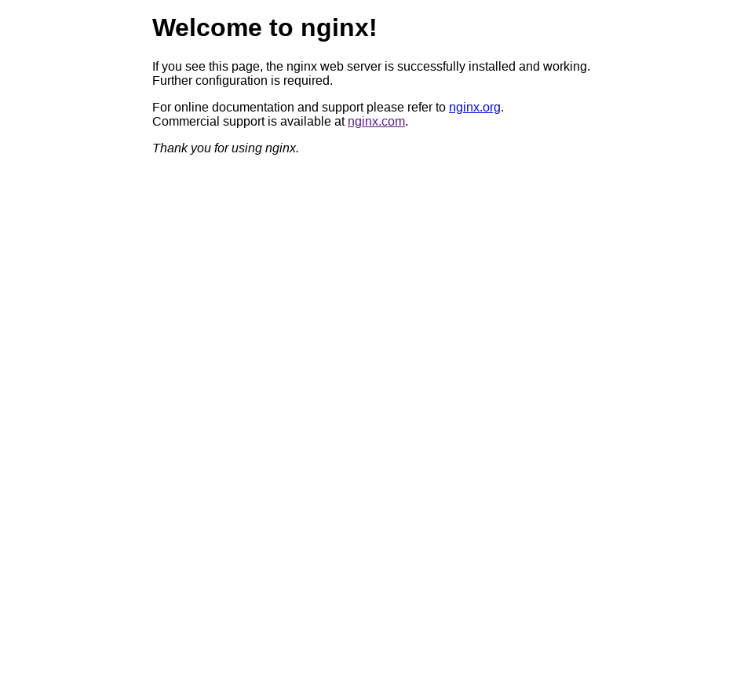

# Consul

## 安装

### Linux

> wget https://releases.hashicorp.com/consul/1.5.2/consul_1.5.2_linux_amd64.zip

然后在当前目录会有`consul_1.5.2_linux_amd64.zip`, 注意是 zip,要使用相应的工具进行解压

> unzip -d /usr/local consul_1.5.2_linux_amd64.zip

`-d`　 directory 的意思，将文件解压到/usr/local 目录下

如果提示`-bash: unzip: command not found`, 那么是因为没有安装`zip`工具，这个时候直接用`apt`安装即可

> apt-get instal zip

然后就可以在`bash`下输入 consul 命令啦</br>
如果提示`-bash: consul: command not found`,是因为 bash 没有给这个`consul`建立链接，在`PATH`下也无法找到，这个时候可以简单的给这个`consul`建立一个软链接

> sudo ln -s /usr/local/consul /usr/local/bin/consul

这样在`bash`里输入`consul`就不会出错啦

### 介绍

`consul`是高可用，可插拔的服务注册工具(暂时这么理解)。它的原理大致如下

每个主机有一个`consul client`,`consul server`集群在服务注册中心，`consul server`会选出一个`Leader`。当服务之间需要调用时，需要先向`consul client`请求，然后它会向`consul server`取出请求的服务的状态、ip、port 等信息

### 使用

> docker run -d --name=c1 -p 8500:8500 consul agent -dev -client=0.0.0.0 -bind=0.0.0.0

`consul agent -dev`　是在开发模式下运行一个`consul client`，也就是负责和`consul server`通信的节点`node`。

如果没有`consul image`，会先从 dockerhub 拉取镜像。
拉取镜像之后，会建立`docker container`，并进行运行</br>
成功之后，可以查看`docker container`信息

> docker ps

查看`consul node`信息，可以在命令行输入

> curl localhost:8500/v1/catalog/nodes

如果提示`command not found`，则可以进行相应软件的安装即可

> consul members

查看简略信息

也可以查看`localhost:8500/ui`，默认会打开`consul web ui`以查看`consul node`的状态信息

> 

此时，还没有服务注册到这个`consul client`上面，查看服务的列表，显示是空

> curl http://localhost:8500/v1/agent/services

上面的命令返回的东西可能是类似下面的结果

```json
{}
```

####　注册服务

1. 我们先开启一个服务，这里演示一个 web 服务

> docker run --name nginx -d -p 80:80 nginx

这条命令会运行一个`nginx`的`docker container`，并将端口映射到主机的`80`。

> localhost



访问主机就会进入 nginx 的页面

2. 我们通过写配置文件的方式，把服务注册到刚才启动的`consul client`上去

```json
{
  "ID": "web",
  "Name": "web",
  "Address": "127.0.0.1",
  "Port": 80
}
```

配置文件写好后，我们直接通过`http`发送到`consul client`注册自己的服务

> curl -X PUT --data-binary @service.json http://localhost:8500/v1/agent/service/register

这个时候再访问之前的`consul client`的注册服务路由

> curl http://localhost:8500/v1/agent/services

就会得到类似下面的信息

```json
{
  "web": {
    "ID": "web",
    "Service": "web",
    "Tags": [],
    "Meta": {},
    "Port": 80,
    "Address": "127.0.0.1",
    "Weights": {
      "Passing": 1,
      "Warning": 1
    },
    "EnableTagOverride": false
  }
}
```

#### 建立`agent`集群

在之前的基础上，我们再运行另外两个`consul client`

> docker run -d --name c2 consul agent -dev -bind=0.0.0.0 -join=\$IP

> docker run -d --name c3 consul agent -dev -bind=0.0.0.0 -join=\$IP

这个时候，我们第一个`container`里已经建立起`consul client`的集群了

> $ docker exec -it c1 sh</br>
 $ consul members

输出类似下面的结果

```
Node          Address          Status  Type    Build  Protocol  DC   Segment
6a576ca2f82b  172.17.0.2:8301  alive   server  1.5.2  2         dc1  <all>
abe83cce02e4  172.17.0.5:8301  alive   server  1.5.2  2         dc1  <all>
e51f11b7a4d8  172.17.0.4:8301  alive   server  1.5.2  2         dc1  <all>

```
