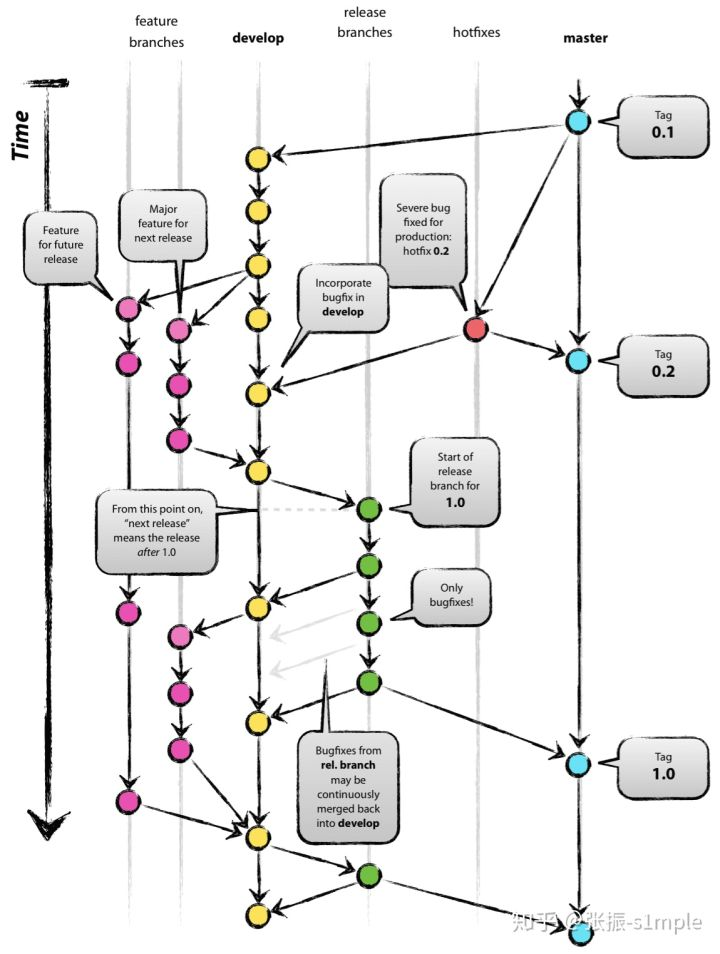

# Git flow
> https://zhuanlan.zhihu.com/p/43844470

> https://www.git-tower.com/learn/git/ebook/cn/command-line/advanced-topics/git-flow
## 设置Git flow
Git flow的工作图如下：

在一个目录下初始化git flow：
```bash
$ git flow init
Initialized empty Git repository in /Users/tobi/acme-website/.git/
Branch name for production releases: [master] 
Branch name for "next release" development: [develop] 

How to name your supporting branch prefixes?
Feature branches? [feature/] 
Release branches? [release/] 
Hotfix branches? [hotfix/] 
```
init为分支配置了一些命名规则。一般情况下，使用默认的命名规则。

## Master & Develop
`master`和`develop`是两个长期分支。
* `master`分支上存放的是最稳定的正式版本，并且该分支的代码应该是随时可在生产环境中使用的代码（Production Ready state）。当一个版本开发完毕后，产生了一份新的稳定的可供发布的代码时，`master`分支上的代码要被更新。同时，每一次更新，都需要在 `master`上打上对应的版本号（tag）。
* 任何人不允许在`master`上进行代码的直接提交，只接受其他分支的合入。原则上`master`上的代码必须是合并自经过多轮测试且已经发布一段时间且线上稳定的`release`分支（预发分支）
* `develop`分支是主开发分支，其上更新的代码始终反映着下一个发布版本需要交付的新功能。当`develop`分支到达一个稳定的点并准备好发布时，应该从该点拉取一个`release`分支并附上发布版本号。

* `develop`分支接受其他 Supporting branches 分支的合入，最常见的就是 `feature`分支，开发一个新功能时拉取新的`feature`分支，开发完成后再并入 `develop`分支。需要注意的是，合入`develop`的分支必须保证功能完整，不影响`develop`分支的正常运行。
## Feature
`feature`分支又叫做功能分支，一般命名为 `feature/xxx`，用于开发即将发布版本或未来版本的新功能或者探索新功能。该分支通常存在于开发人员的本地代码库而不要求提交到远程代码库上，除非几个人合作在同一个`feature`分支开发。
</br>开始一个Feature（Feature名称为rss-feed）：
```bash
$ git flow feature start rss-feed
Switched to a new branch 'feature/rss-feed'

Summary of actions:
- A new branch 'feature/rss-feed' was created, based on 'develop'
- You are now on branch 'feature/rss-feed'
```
之后在本地进行commit。当完成该Feature的开发后，结束该分支：
```bash
$ git flow feature finish rss-feed
Switched to branch 'develop'
Updating 6bcf266..41748ad
Fast-forward
    feed.xml | 0
    1 file changed, 0 insertions(+), 0 deletions(-)
    create mode 100644 feed.xml
Deleted branch feature/rss-feed (was 41748ad).
```
Git flow会自动删除该`feature`分支并并入`develop`。

## Release
`release`分支又叫做预发分支，一般命名为 `release/1.2`（后面是版本号），该分支专为测试—发布新的版本而开辟，允许做小量级的 Bug 修复和准备发布版本的元数据信息（版本号、编译时间等）。通过创建 `release`分支，使得 `develop`分支得以空闲出来接受下一个版本的新的 `feature`分支的合入。`release`分支只能拉取自`develop`分支，合并回 `develop`和`master`分支
</br>生成一个新的Release(版本号为1.1.5)：
``` bash
$ git flow release start 1.1.5
Switched to a new branch 'release/1.1.5'
```
有了一个`release`分支，再完成针对 release 版本号的最后准备工作（如果项目里的某些文件需要记录版本号），并且进行最后的编辑。
</br>发布一个新的release：
``` bash
git flow release finish 1.1.5
```
这个命令会完成如下一系列的操作：
1. 首先，git-flow 会拉取远程仓库，以确保目前是最新的版本。
2. 然后，release 的内容会被合并到 “master” 和 “develop” 两个分支中去，这样不仅产品代码为最新的版本，而且新的功能分支也将基于最新代码。
3. 为便于识别和做历史参考，release 提交会被标记上这个 release 的名字（在我们的例子里是 “1.1.5”）。
4. 清理操作，版本分支会被删除，并且回到 “develop”。

从 Git 的角度来看，release 版本现在已经完成。依据你的设置，对 `master`的提交可能已经触发了你所定义的部署流程，或者你可以通过手动部署，来让你的软件产品进入你的用户手中。

## Hotfix
很多时候，仅仅在几个小时或几天之后，当对 release 版本作做全面测试时，可能就会发现一些小错误。
在这种情况下，git-flow 提供一个特定的`hotfix`工作流程（因为在这里不管使用 “功能” 分支流程，还是`release`分支流程都是不恰当的）。

创建一个hotfix：
``` bash
$ git flow hotfix start missing-link
```
这个命令会创建一个名为 “hotfix/missing-link” 的分支。因为这是对产品代码进行修复，所以这个`hotfix`分支是基于 `master`分支。
这也是和`release`分支最明显的区别，`release`分支都是基于`develop`分支的。因为你不应该在一个还不完全稳定的开发分支上对产品代码进行地修复。
就像`release`一样，修复这个错误当然也会直接影响到项目的版本号！

完成一个hotfix：
``` bash
$ git flow hotfix finish missing-link
```
这个过程非常类似于发布一个 release 版本：
1. 完成的改动会被合并到`master`中，同样也会合并到`develop`分支中，这样就可以确保这个错误不会再次出现在下一个 release 中。
2. 这个 hotfix 程序将被标记起来以便于参考。
3. 这个 hotfix 分支将被删除，然后切换到 `develop` 分支上去。

还是和产生 release 的流程一样，现在需要编译和部署你的产品（如果这些操作不是自动被触发的话）。
