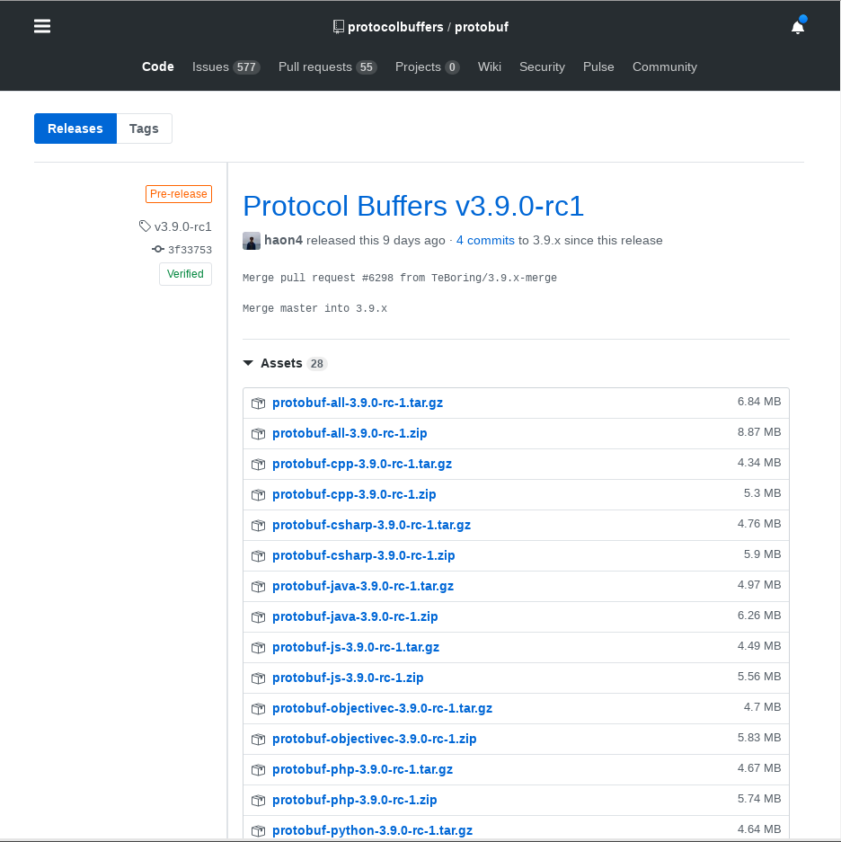

# Go micro

## 安装

安装部分其实没什么好说的，但是这里想说明的是`go get`和`go mod`的区别和使用

### go get

`go get`是较早版本的`Go`的包管理工具，`go get`有一个全局的包存放处，也就是`GOPATH`，但是，这也会带来一个问题，倘若你的工程以来了两个不同版本的库，那么一个`GOPATH`就会出现问题，这个时候可以解决的办法就是使用两个不同的`GOPATH`。

### go mod

`go mod`是`Go`社区庞大之后推出的包管理工具.`go mod`类似于`Maven`，它会将所有需要用到的库缓存在本地，在工程目录里有一个`go.mod`，`go.mod`的作用就类似于`pom.xml`，它会根据工程`import`的库下载依赖，并将依赖放在`GOPATH/pkg/mod`下。

如果要下载`go-micro`,部分依赖需要翻墙，这个时候就需要想点办法。

- 使用[https://goproxy.io](https://goproxy.io) 这是一个专门作`go modules`的代理的网站，但有些镜像这个网站可能更新没有那么及时，就可能会出现下列错误
  `go get: error loading module requirements`

- 这个时候没有别的办法，只能让终端走代理，或者你用国外的服务器下载下来再拷贝到本地，或者写个脚本去 github.com 上去下载下来然后 extract。总之都很麻烦，走代理是比较简单的，一般使用 Go 的应该不会不知道走代理是什么意思

#### 走代理

终端走代理和浏览器走代理不一样的
浏览器走了代理，比如 shadowsocks，终端并不一定走了代理，这个时候需要使用终端代理工具

- proxychains

这工具据说很好用，但是我下载下来直接修改配置似乎不行，这里也就不做介绍

- privoxy

这个工具是我一个大佬同学告诉我的，确实很好用，但是它也会对`micro`造成一定困扰，在使用代理的情况下，终端发送请求到注册的服务，会出现`500`的错误，这个后面会介绍

这里简单介绍下`privoxy`的使用

> sudo apt-get install privoxy

> sudo vim /etc/privoxy/config

添加下面的配置

```bash
#        forward-socks4a   /              socks-gw.example.com:1080  www-cache.isp.example.net:8080
#        forward           .example.com   .
#
#      A rule that uses a SOCKS 4 gateway for all destinations but no
#      HTTP parent looks like this:
#
#        forward-socks4   /               socks-gw.example.com:1080  .
#
#      To chain Privoxy and Tor, both running on the same system, you
#      would use something like:
#
forward-socks5t   /    127.0.0.1:1080 .
```

重启`privoxy`

> sudo /etc/init.d/privoxy restart

然后当你需要在终端走代理的时候

> export http_proxy=127.0.0.1:8118

> export https_proxy=127.0.0.1:8118

之所以没有直接在 `~/.bashrc`中进行配置，是为了防止全部都走代理，从而导致你的`go-micro`程序出现 bug

### 运行`micro/examples`的`greeter`示例

1. 下载 `examples`

这里有一个坑，如果你下载的是近期的 `examples`,　它依赖的是`go-micro@v1.7`，这些可能会出问题，会报`500`的`HTTP`错误

如果出现了这个错误，就把代码回退到１５天前的版本，使用`go-microv1.5`是没有问题的

2. 下载`consul`

如果你已经下载了`consul`,那么直接运行就行了

> consul agent -dev

这条命令会启动一个`consul client`，用于注册服务

3. 编译 `proto`
   如果是自己写代码是需要编译`proto`的，但是直接`git clone https://github.com/micro/examples`，是不需要再编译`proto`了，但是编译`proto`的工具值得注意，这个工具以后肯定是要使用的

> go get -d -u github.com/golang/protobuf/protoc-gen-go

> go get -d -u github.com/micro/protoc-gen-micro

然后去`github`上下载`protoc`的`release`,下载对应的系统版本即可
[protoc 网页](https://github.com/protocolbuffers/protobuf/releases)



如果你是`linux`，下载`linux`， `windows`下载`windows`即可

下载好之后，将可执行文件`protoc`放入`GOPATH/bin`中即可，或者放入任何`PATH`中

编译命令自行搜索，我也是临时使用搜索的

4. 运行 service
   假设当前目录是`examples`
   > examples\$ go run ./srv/main.go --registry=consul

默认的服务注册已经变成了`mdns`，因此使用`consul`注册的时候需要制定`--registry=consul`

5. 运行 client

> examples\$ go run ./cli/main.go --registry=consul

这里的`--registry=consul`并不是去注册服务，而是通过`consul`来调用服务，毕竟服务是注册在`consul`上的

如果一切正常会输出一下信息

> examples\$ Hello, John

如果报了`HTTP 500`的错误，可以检查是不是开了`privoxy`的原因，如果环境变量已经更改但还是不行，可以考虑重启一下 `bash`

> kill -9 -1

这会杀死所有进程，相当与注销

如果还不行，可以尝试重启系统，我就是重启的, 2333333

如果包了`HTTP 408 timeout`错误，可以在`consul`检查一下服务注册的`ip`,也就是`Address`那一栏，是不是`Address`是不可访问的，如果是，这个具体怎么办我也不是很清楚，继续学习中...

希望之后的学习不要再碰到这么大的坑了，这个坑浪费我一整天的时间了

## examples 学习

- [] api
- [] booking
- [] broker
- [] client
- [] command
- [] config
- [] event
- [] filter
- [] flags
- [] form
- [] function
- [] fetip
- [] graceful
- [x] greeter
- [] grpc
- [] heartbeat
- [x] helloworld
- [] kubernetes
- [] metadata
- [] mocking
- [] noproto
- [] options
- [] plugins
- [] proxy
- [] pubsub
- [] redirect
- [] roundrobin
- [] secure
- [] server
- [] service
- [] sharding
- [] shutdown
- [] stream
- [] template
- [] waitgroup
- [] wrapper
