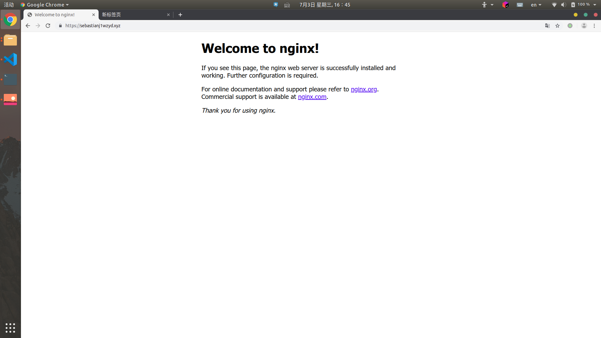
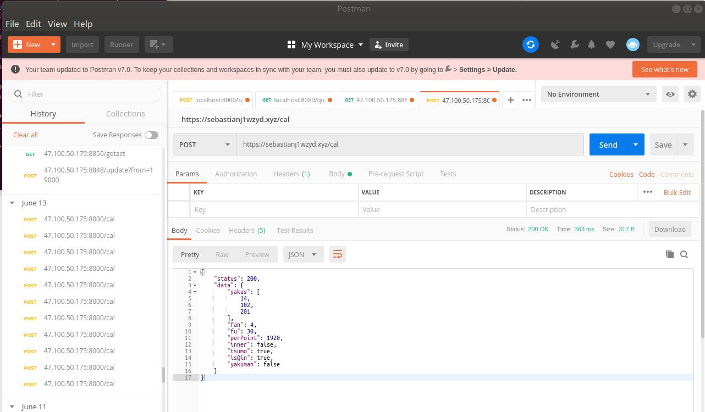

# Https and Reverse Prxy

## Https

We buy a domain name on Aliyun, and attached a ssl certification to it. Now it's deployed and successfully responsing.

## Proxy

To use the resources provided by school and use https protocol, we use the aliyun server as a reverse proxy. Now it can correctly running.

