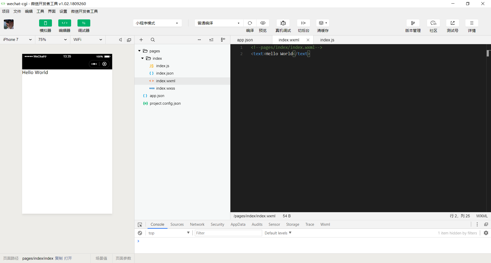

# Wechat CGI Learning Record

<span color="gray" align="right">Start at 10:21 01/07/2019</span>

----------------------------------

## How to start

1. The first step in developing a wechat-cgi is to have a wechat-cgi account through which you can manage your wechat-cgi.

## The Composition of Wechat-cgi

### JSONs

JSON configuration file with `.json` suffix.

#### 1. Applet configuration: app.json

`App.json` is the global configuration of current applets, including all page paths, interface performance, network timeout, bottom tab, etc.

#### 2. Tool configuration: project.config.json

The applet developer tool generates a `project.config.json` in the root directory of each project. Any configuration you make on the tool will be written to this file. When you reinstall the tool or change the computer, you just load the code package of the same project, and the developer tool will automatically help you restore the personalization of the project you were developing at that time. Configuration, which will include the color of the editor, code upload automatic compression and a series of other options.

#### 3. Page configuration: page.json

The `page.json` here is actually used to represent configuration related to applet pages such as `logs.json` in the `pages/logs` directory.

If the style of your entire applet is blue, you can declare that the top color is blue in `app.json`. This may not be the case. Maybe every page in your applet has different hues to distinguish different functional modules. So we provide `page.json`, which allows developers to independently define some attributes of each page, such as the top color just mentioned, whether to allow drop-down refresh, and so on.

#### 4. JSON grammar

JSON files are wrapped in braces {} to express data by key-value. JSON Key must be wrapped in a double quotation mark. In practice, when writing JSON, ***it is common to forget to add double quotation marks to the key value or write double quotation marks as single quotation marks***.

JSON values can only be in the following data formats, and any other format can trigger an error, such as undefined in JavaScript.

1. Numbers, including floating point numbers and integers
2. Strings that need to be wrapped in double quotes
3. Bool value, true or false
4. Arrays that need to be wrapped in square brackets []
5. Object, which needs to be wrapped in braces {}
6. Null

It is also important to note that ***annotations are not available in JSON files***, and attempts to add annotations will cause errors.

### WXML template

People who have been engaged in web programming know that web programming is a combination of **HTML + CSS + JS**, in which HTML is used to describe the structure of the current page, CSS is used to describe the appearance of the page, and JS is usually used to deal with the interaction between the page and the user.

Similarly, in small programs, ***WXML plays the same role as HTML***. Here is an example of WXML.

```html
<view class="container">
  <view class="userinfo">
    <button wx:if="{{!hasUserInfo && canIUse}}"> 获取头像昵称 </button>
    <block wx:else>
      <image src="{{userInfo.avatarUrl}}" background-size="cover"></image>
      <text class="userinfo-nickname">{{userInfo.nickName}}</text>
    </block>
  </view>
  <view class="usermotto">
    <text class="user-motto">{{motto}}</text>
  </view>
</view>
```

The Wechat applet provides a data binding mechanism similar to `React` and `Vue`. JS can not directly manipulate dom, instead you should use `wx:if` and other operations.

### WXSS Style

***WXSS has most of the features of CSS***, and wechat-cgi have also made some extensions and modifications in WXSS.

1. New size units have been added. WXSS supports the new size unit `rpx`. You just need to submit it to the underlying of the wechat-cgi to convert to suit for different mobile devices. The result will be slightly different from the expected result due to float numbers.

2. Global and local styles are provided. Like `app.json`, `page.json`, you can write an `app.wxss` as a global style that will work on all pages of the current applet, while the local page style `page.wxss` only works on the current page.

3. In addition, WXSS only supports partial CSS selectors.

### JSs

Just like development of frontend, ***we write JS files to handle user operations.***

## Wechat-cgi Host Environment

### Rendering Layer and Logical Layer

The running environment of the widget is divided into rendering layer and logic layer, in which ***WXML template and WXSS style work in rendering layer and JS script work in logic layer.***

The rendering layer and logic layer of the applet are managed by two threads respectively: the interface of the rendering layer uses WebView to render, and the logic layer uses JsCore threads to run JS scripts. There are many interfaces in a small program, so there are many WebView threads in the rendering layer. The communication between the two threads will be transferred through the Wechat client (hereinafter, the Native will be used to refer to the Wechat client), and the logical layer will send network requests through the Native forwarding. The communication model of the widget is shown in the figure below.


### Programs and Pages

Before opening the widget, the client will download the code package of the whole widget locally.

Through the pages field of app.json, you can know all the page paths of your current applet:

```json
{
  "pages":[
    "pages/index/index",
    "pages/logs/logs"
  ]
}
```

The first page written in the pages field is the home page of the applet (the first page you see when you open the applet).

After the applet starts, the onLaunch callback of the App instance defined by app.js is executed:

```js
App({
  onLaunch: function () {
    // 小程序启动之后 触发
  }
})
```

The whole applet has only one instance of App, which is shared by all pages.

Next, let's take a brief look at how a page of the applet is written.

You can see that there are actually four kinds of files under `pages/logs/logs`. The Wechat client will first generate an interface according to the `logs.json` configuration. You can define the color and text at the top of the interface in the JSON file. Next, the client loads the `WXML` structure and `WXSS` style of the page. Finally, the client loads `logs.js`, and you can see that the overall content of `logs.js` is as follows:

```js
Page ({)
    data: {// Participating in Page Rendering Data
        logs: []
    }
    onLoad: function (){
        // Execute after page rendering
    }
}
```

`Page` is a page constructor that generates a page. When generating a page, the widget framework renders the `data` and `index.wxml` together to render the final structure, and you get the look of the widget you see.

After rendering the interface, the page instance will receive a callback `onLoad`, where you can process your logic.

### Components

Wechat provides abundant basic components for developers, who can assemble various components to assemble their own small programs just like building blocks.

### API

The applet provides many APIs for developers to use, such as access to user information, Wechat payment and so on.

***Note that most API callbacks are asynchronous, and you need to deal with the asynchronous problem of code logic.***

## Hello World



## Development

Now the user interface has been initially developed. Code is in `../code/wechat-cgi/` folder.

And today I bought a Aliyun domain name and doing some SSL things.